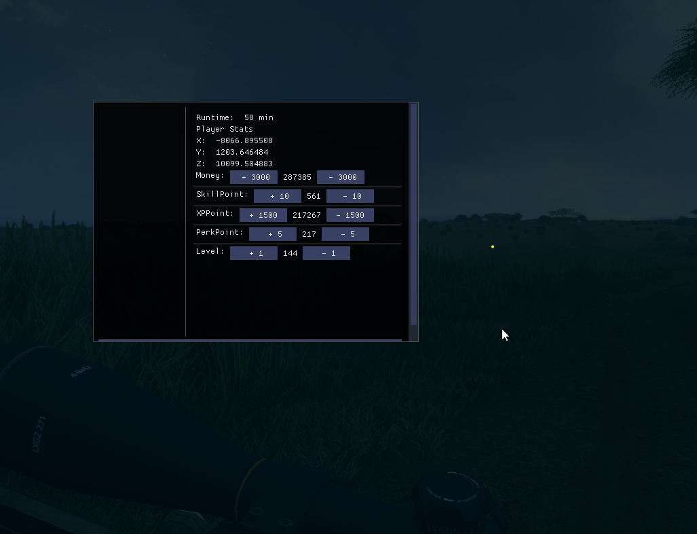

# Snowy-THCOTW-Internal-Cheat
theHunter: Call of the Wild Internal Cheat
You will need to use your own injector. I recommend the guided hacking injector. LoadLibraryExW/NtCreateThreadEx is fine. x64.

Includes:
- FOV Slider
- Is Multiplayer
- Is host
- Players in session
- Item in hand
- Time in multiplayer session
- Set time (server sided if host)
- Set time multiplier
- Set Money, Skillpoints, XPoint, Perkpoints, Level
- Get player coords
- Unhook
- Fast exit game

Todo:
- Animal and player ESP
- Unlocks
- Instant kill all animals nearby
- Teleport all animals to you
- Playerlists
- player check, map check, outpost unlocks
- More

Just very basic options at the moment that honestly should be enough for everyone to have a little fun.

v0.2 - 19/01/2023

    
     
    <a href="https://iiferedon.xyz"><strong>My Website »</strong></a>
     
     
  

